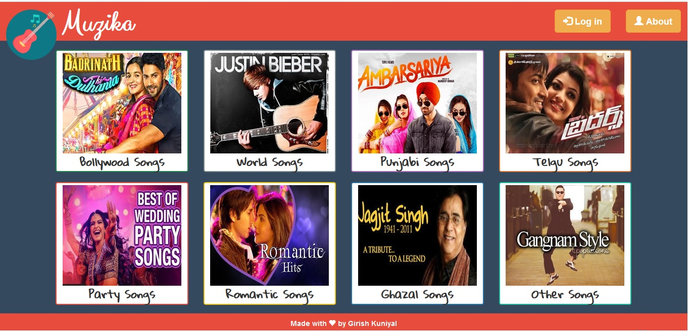

# Muzika

 

Muzika is a music website theme which can be used to stream online music via HTML5 . Click [here](http://muzikaa.000webhostapp.com) to see the demo.
#### Dependencies

  - php 7
  - mysql

### Features

  - Admin panel for add, remove or rank song
  - Easy to use user interface
  


### How to use : 
1. Rename all fields like website name and about page according to your site.
2. Upload song on webserver like amazon web services, one drive or dropbox.with file hierarchy.
```
    /category_name/poster/*.jpg
    /category_name/song/*.mp3
```
3. Rename categories fields according to your website **categories** in addsongscript.php, rankscript.php and removescript.php .for example change code like this :
```php
if($_POST["category"]=="bollywood"){
	$tablename = "Bollywood";
}
elseif($_POST["category"]=="world"){
	$tablename = "World";
}
```
4. Changes cookies setting in input folder and adjust according to your category.
5. Upload these all files on webhosting server (000webhost,bigrock,godaddy etc)
6. Setup and create Database on webhosting server for admin and songs. create table for each category. add fields like rank, song, film, songlocation, songposter.

### Todos

 - Add Responsiveness via adding some creative *CSS*.
 - Directly connectivity with online services (Google Drive, OneDrive or Dropbox)


**Free code, Hell Yeah!**
